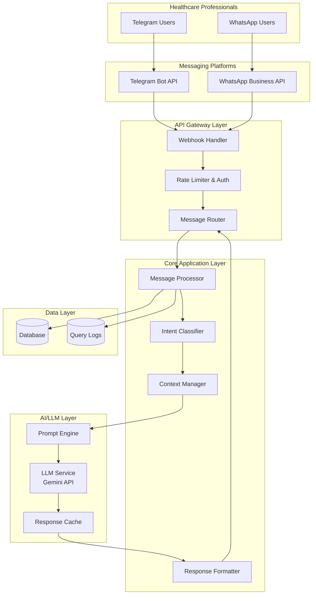
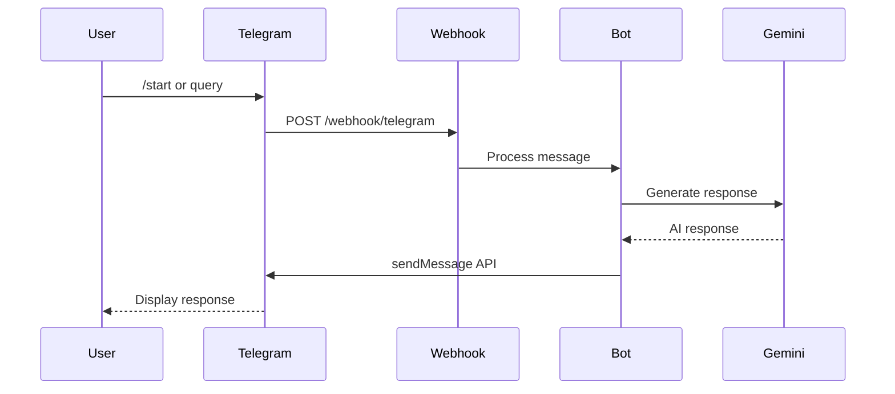
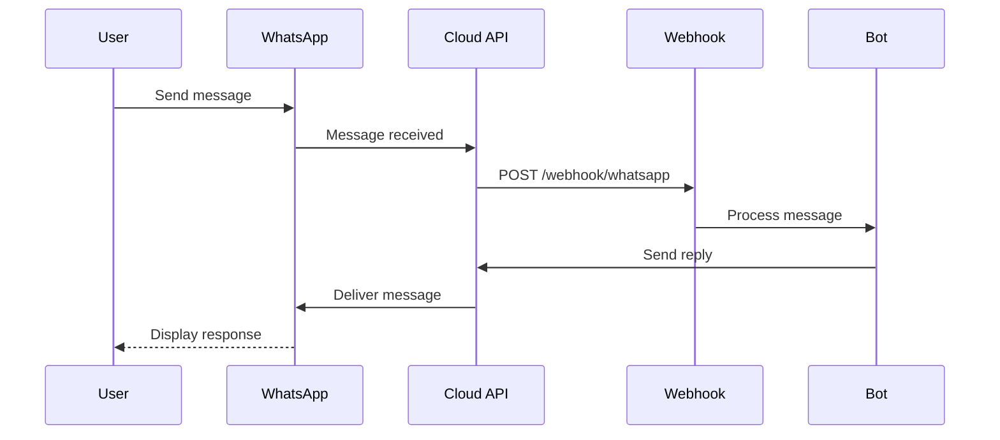
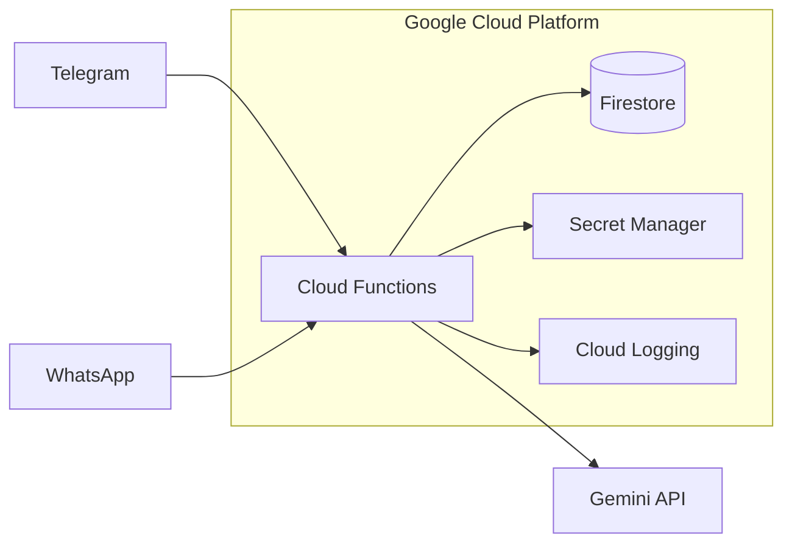

# System Architecture Design
## Drug Info and Guideline Bot

**Version:** 1.0  
**Date:** January 18, 2026  
**Status:** Draft

---

## 1. Architecture Overview



---

## 2. Component Architecture

### 2.1 Layer Breakdown

| Layer | Responsibility | Key Technologies |
|-------|---------------|------------------|
| **Messaging Platforms** | User interface via chat | Telegram Bot API, WhatsApp Business API |
| **API Gateway** | Ingress, routing, security | Cloud Functions / Express.js |
| **Core Application** | Business logic, orchestration | Node.js / Python |
| **AI/LLM Layer** | Intelligence & response generation | Google Gemini API |
| **Data Layer** | Persistence, logging | Firebase Firestore / PostgreSQL |

---

## 3. Component Details

### 3.1 Webhook Handler
**Responsibility:** Receive incoming messages from all platforms

```
┌─────────────────────────────────────────┐
│           Webhook Handler               │
├─────────────────────────────────────────┤
│ • POST /webhook/telegram                │
│ • POST /webhook/whatsapp                │
│ • Signature validation                  │
│ • Request parsing & normalization       │
│ • Error handling & acknowledgment       │
└─────────────────────────────────────────┘
```

**Design Decisions:**
- Single endpoint per platform for clarity
- Immediate 200 OK response to prevent retries
- Async processing via message queue (optional)

---

### 3.2 Message Router
**Responsibility:** Normalize and route messages to processors

```
┌─────────────────────────────────────────┐
│           Message Router                │
├─────────────────────────────────────────┤
│ Input: Raw platform message             │
│ Output: Normalized message object       │
├─────────────────────────────────────────┤
│ {                                       │
│   platform: "telegram" | "whatsapp",    │
│   userId: string,                       │
│   chatId: string,                       │
│   text: string,                         │
│   timestamp: Date,                      │
│   replyTo?: string                      │
│ }                                       │
└─────────────────────────────────────────┘
```

---

### 3.3 Intent Classifier
**Responsibility:** Determine user intent from message

| Intent | Example Queries | Action |
|--------|-----------------|--------|
| `DRUG_INFO` | "Tell me about metformin" | Lookup drug details |
| `DRUG_INTERACTION` | "Can I give warfarin with aspirin?" | Check interactions |
| `DOSAGE_QUERY` | "Amoxicillin dose for 10kg child" | Calculate dosage |
| `GUIDELINE_QUERY` | "Hypertension treatment guideline" | Fetch guidelines |
| `HELP` | "/help", "What can you do?" | Show help message |
| `UNKNOWN` | Unclear or off-topic | Clarification prompt |

**Implementation Options:**
1. **LLM-based classification** - Use Gemini to classify intent
2. **Keyword + LLM hybrid** - Quick keyword match, fallback to LLM
3. **Custom ML model** - Train dedicated intent classifier (future)

> [!TIP]
> Recommend **Option 2** - Balance speed with accuracy

---

### 3.4 Context Manager
**Responsibility:** Maintain conversation state

```
┌─────────────────────────────────────────┐
│           Session Context               │
├─────────────────────────────────────────┤
│ {                                       │
│   sessionId: string,                    │
│   userId: string,                       │
│   platform: string,                     │
│   currentIntent: Intent,                │
│   conversationHistory: Message[],       │
│   lastDrugMentioned: string?,           │
│   pendingQueries: any[],                │
│   createdAt: Date,                      │
│   expiresAt: Date  // 30 min TTL       │
│ }                                       │
└─────────────────────────────────────────┘
```

**State Management Options:**
| Option | Pros | Cons |
|--------|------|------|
| In-memory (Redis) | Fast, simple | Requires Redis instance |
| Firestore | Serverless, scalable | Slight latency |
| Session in message | No state server | Limited history |

> [!TIP]
> Recommend **Firestore** for serverless deployment with session TTL

---

### 3.5 Prompt Engine
**Responsibility:** Construct optimized prompts for LLM

#### Prompt Structure
```
┌─────────────────────────────────────────┐
│           Prompt Template               │
├─────────────────────────────────────────┤
│ [SYSTEM PROMPT]                         │
│ Role, constraints, medical guidelines   │
├─────────────────────────────────────────┤
│ [CONTEXT INJECTION]                     │
│ Conversation history, extracted entities│
├─────────────────────────────────────────┤
│ [USER QUERY]                            │
│ Current user message                    │
├─────────────────────────────────────────┤
│ [OUTPUT INSTRUCTIONS]                   │
│ Format, length, structure requirements  │
└─────────────────────────────────────────┘
```

#### System Prompt (Draft)
```
You are a clinical decision support assistant for healthcare professionals.
You provide:
- Drug information (indications, contraindications, side effects)
- Drug-drug interaction assessments
- Evidence-based clinical guidelines
- Dosage calculations and adjustments

Rules:
1. Always cite sources when providing guidelines
2. Clearly state severity levels for drug interactions
3. Include appropriate medical disclaimers
4. Format responses for mobile chat readability
5. Ask clarifying questions when information is insufficient
6. Never provide advice for patient self-medication
```

---

### 3.6 LLM Service (Gemini Integration)
**Responsibility:** Generate AI responses

```
┌─────────────────────────────────────────┐
│           LLM Service                   │
├─────────────────────────────────────────┤
│ Provider: Google Gemini API             │
│ Model: gemini-2.0-flash (recommended)   │
├─────────────────────────────────────────┤
│ Configuration:                          │
│ • Temperature: 0.3 (factual responses)  │
│ • Max tokens: 1024                      │
│ • Safety settings: Standard             │
├─────────────────────────────────────────┤
│ Features:                               │
│ • Retry with exponential backoff        │
│ • Fallback to cached responses          │
│ • Usage tracking & cost monitoring      │
└─────────────────────────────────────────┘
```

---

### 3.7 Response Formatter
**Responsibility:** Format LLM output for chat platforms

#### Platform-Specific Formatting
| Element | Telegram | WhatsApp |
|---------|----------|----------|
| Bold | `*text*` | `*text*` |
| Italic | `_text_` | `_text_` |
| Code | `` `text` `` | ``` `text` ``` |
| Lists | Standard markdown | Limited support |
| Buttons | Inline keyboards | Quick reply buttons |

#### Response Templates
```
[DRUG INFO TEMPLATE]
💊 *{drug_name}*
├─ Class: {drug_class}
├─ Indications: {indications}
├─ Contraindications: {contraindications}
├─ Common side effects: {side_effects}
└─ Standard dose: {dosage}

⚠️ {disclaimer}
```

---

## 4. Platform Integration Details

### 4.1 Telegram Bot Setup



**Required Setup:**
1. Create bot via @BotFather
2. Set webhook URL
3. Configure bot commands

**Bot Commands:**
| Command | Description |
|---------|-------------|
| `/start` | Welcome message and instructions |
| `/help` | Show usage guide |
| `/drug <name>` | Quick drug lookup |
| `/interact <drug1> <drug2>` | Check interaction |
| `/dose <drug> <patient_info>` | Calculate dosage |
| `/guideline <condition>` | Get treatment guideline |
| `/cancel` | Reset conversation |

---

### 4.2 WhatsApp Business API Setup



**Required Setup:**
1. Facebook Business Account
2. WhatsApp Business API access
3. Phone number registration
4. Message template approval (for proactive messages)

**Integration Options:**
| Option | Description | Cost |
|--------|-------------|------|
| WhatsApp Cloud API | Facebook-hosted, easier setup | Per-conversation pricing |
| On-premise API | Self-hosted, more control | Higher infrastructure cost |
| BSP (Twilio, etc.) | Third-party provider | Provider fees + WhatsApp fees |

> [!TIP]
> Recommend **WhatsApp Cloud API** for initial deployment (simpler, lower cost)

---

## 5. Security Architecture

### 5.1 Security Layers

```
┌─────────────────────────────────────────┐
│           Security Layers               │
├─────────────────────────────────────────┤
│ 1. Transport: TLS 1.3 everywhere        │
│ 2. Webhook: Signature verification      │
│ 3. Rate Limiting: 30 req/min/user       │
│ 4. API Keys: Secure storage (Secrets)   │
│ 5. Logging: No PHI in logs              │
│ 6. Input: Sanitization & validation     │
└─────────────────────────────────────────┘
```

### 5.2 Secret Management
| Secret | Storage Location |
|--------|------------------|
| Telegram Bot Token | Cloud Secret Manager |
| WhatsApp API Token | Cloud Secret Manager |
| Gemini API Key | Cloud Secret Manager |
| Database credentials | Cloud Secret Manager |

### 5.3 Data Flow Security
```
User ──[TLS]──> Platform ──[TLS]──> Webhook ──[Internal]──> Services
                                        │
                                        └──> Logs (anonymized)
```

---

## 6. Deployment Architecture

### 6.1 Recommended: Serverless (Google Cloud)



**Benefits:**
- Zero server management
- Pay-per-use pricing
- Auto-scaling
- Built-in security

### 6.2 Alternative: Container-based (Cloud Run)

| Aspect | Cloud Functions | Cloud Run |
|--------|-----------------|-----------|
| Cold start | Higher | Lower |
| Complexity | Simpler | More flexible |
| Long-running | Limited (9 min) | Better (60 min) |
| Cost | Per invocation | Per request + CPU time |

> [!NOTE]
> Cloud Functions recommended for initial deployment; migrate to Cloud Run if needed

---

## 7. Scalability Considerations

### 7.1 Bottleneck Analysis

| Component | Potential Bottleneck | Mitigation |
|-----------|---------------------|------------|
| Webhook handler | High traffic burst | Auto-scaling, queue |
| LLM API calls | Rate limits, latency | Caching, batching |
| Database | Read/write contention | Firestore scales automatically |
| Context storage | Session lookup | TTL expiry, Redis (if needed) |

### 7.2 Caching Strategy

```
┌─────────────────────────────────────────┐
│           Caching Layers                │
├─────────────────────────────────────────┤
│ L1: In-memory (function instance)       │
│     - Hot prompts, configuration        │
│     - TTL: Instance lifetime            │
├─────────────────────────────────────────┤
│ L2: Firestore cache collection          │
│     - Common drug queries               │
│     - Frequently asked guidelines       │
│     - TTL: 24 hours                     │
└─────────────────────────────────────────┘
```

---

## 8. Monitoring & Observability

### 8.1 Key Metrics

| Category | Metrics |
|----------|---------|
| **Performance** | Response latency (p50, p95, p99), LLM call duration |
| **Usage** | DAU, queries/day, queries by intent type |
| **Errors** | Error rate, failed LLM calls, webhook failures |
| **Cost** | LLM token usage, function invocations |

### 8.2 Logging Strategy

```
{
  "timestamp": "2026-01-18T10:30:00Z",
  "level": "INFO",
  "platform": "telegram",
  "userId": "hashed_user_id",  // Anonymized
  "intent": "DRUG_INFO",
  "queryLength": 42,
  "responseTime": 1250,
  "llmTokens": 350,
  "success": true
}
```

> [!IMPORTANT]
> Never log actual message content or any PHI

---

## 9. Disaster Recovery

| Scenario | Impact | Recovery Strategy |
|----------|--------|-------------------|
| LLM API down | No AI responses | Fallback to cached responses + "Service temporarily limited" message |
| Database unavailable | No context | Graceful degradation (stateless mode) |
| Function errors | Dropped messages | Retry logic in platforms + error monitoring alerts |
| Complete outage | Service down | Failover to backup region (future) |

---

## 10. Technology Recommendations

### 10.1 Recommended Stack

| Component | Technology | Rationale |
|-----------|------------|-----------|
| **Runtime** | Node.js 20 / Python 3.11 | Async support, ecosystem |
| **Compute** | Google Cloud Functions | Serverless, easy scaling |
| **Database** | Firestore | Serverless, real-time |
| **LLM** | Gemini API (gemini-2.0-flash) | Cost-effective, fast |
| **Secrets** | Secret Manager | Secure, integrated |
| **Monitoring** | Cloud Logging + Monitoring | Native GCP integration |

### 10.2 Development Tools

| Tool | Purpose |
|------|---------|
| TypeScript | Type safety |
| ESLint + Prettier | Code quality |
| Jest | Unit testing |
| Firebase Emulator | Local development |
| ngrok | Local webhook testing |
