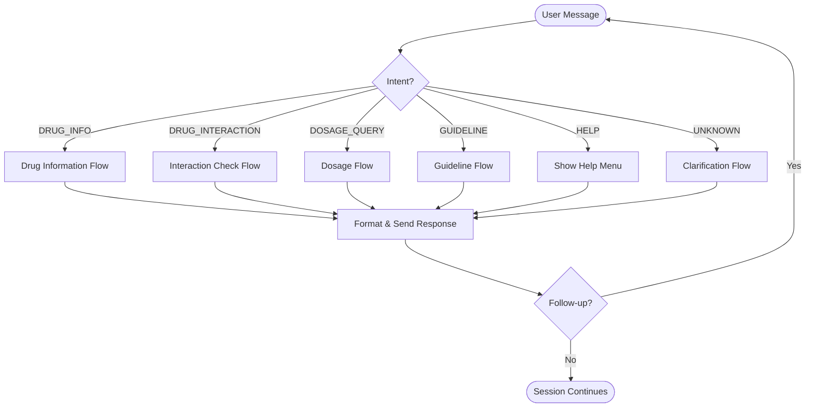
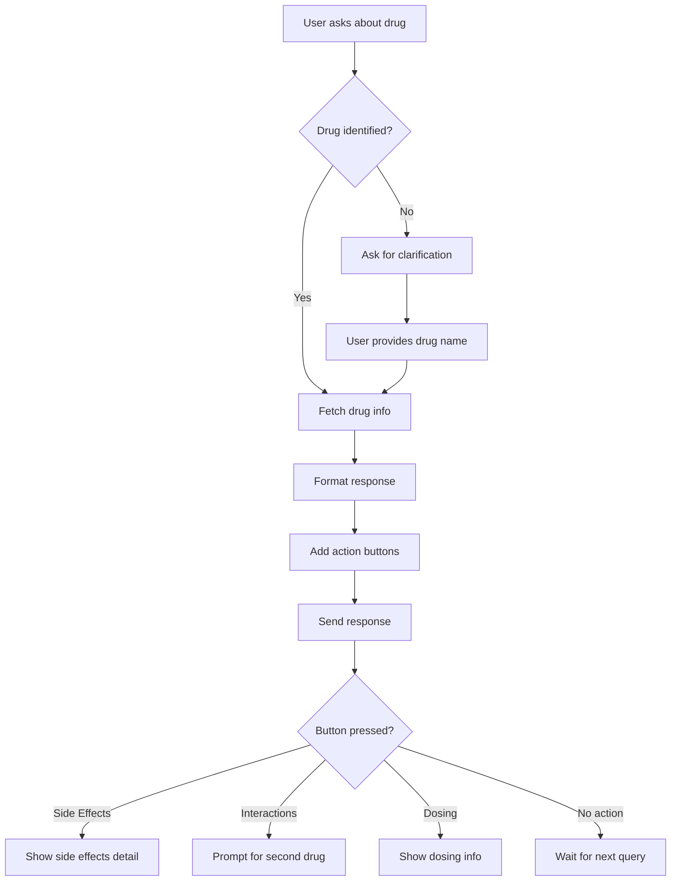
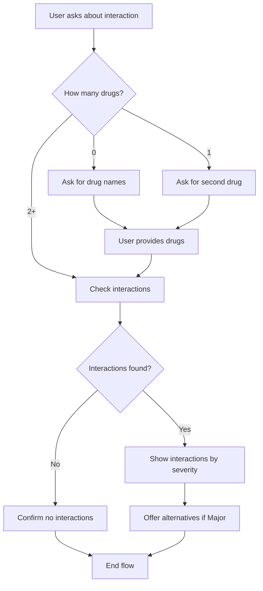
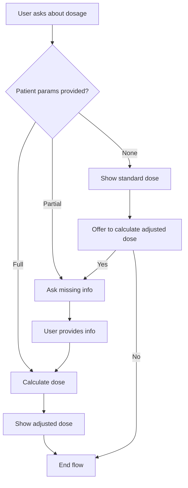
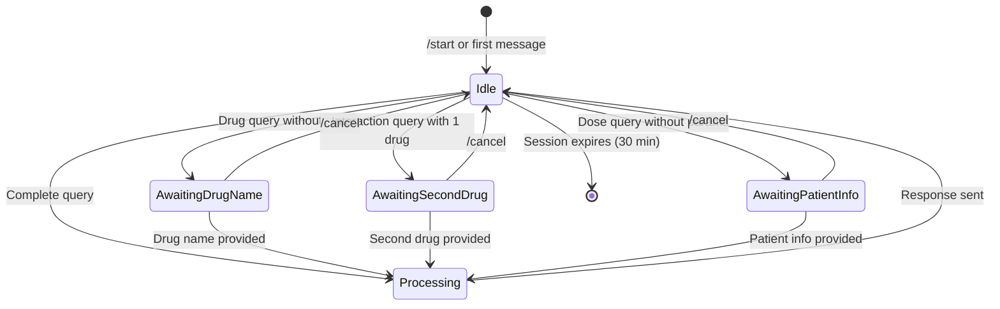

# Conversation Design (UX)
## MedInfo Bot

**Version:** 1.1  
**Date:** February 8, 2026  

---

## 1. Conversation Principles

### 1.1 Design Goals
| Goal | Description |
|------|-------------|
| **Speed** | Answers in < 3 seconds; minimal back-and-forth |
| **Clarity** | Structured, scannable responses for busy professionals |
| **Trust** | Accurate information with cited sources |
| **Forgiveness** | Graceful handling of typos, abbreviations, varied phrasing |
| **Professionalism** | Appropriate tone for clinical context |

### 1.2 Conversation Tone
```
✅ Professional but friendly
✅ Concise and direct
✅ Emoji for visual hierarchy (not excessive)
✅ Clinical terminology (users are HCPs)

❌ Overly casual or chatty
❌ Lengthy prose paragraphs
❌ Condescending explanations
❌ Marketing language
```

---

## 2. Conversation Flow Diagrams

### 2.1 Main Flow



### 2.2 Drug Information Flow



### 2.3 Drug Interaction Flow



### 2.4 Dosage Calculation Flow



---

## 3. Bot Commands

### 3.1 Command Structure

| Command | Description | Example |
|---------|-------------|---------|
| `/start` | Welcome & onboarding | `/start` |
| `/help` | Show all commands | `/help` |
| `/drug <name>` | Quick drug lookup | `/drug metformin` |
| `/interact <drug1>, <drug2>` | Check interaction | `/interact warfarin, aspirin` |
| `/dose <drug> [params]` | Calculate dosage | `/dose amoxicillin 15kg child` |
| `/guideline <condition>` | Treatment guideline | `/guideline hypertension` |
| `/country` | Change country/region | `/country` |
| `/cancel` | Reset conversation | `/cancel` |
| `/feedback` | Send feedback | `/feedback` |

### 3.2 Natural Language Alternatives

The bot understands natural language. Commands are shortcuts, not requirements:

| Command | Natural Language Equivalents |
|---------|------------------------------|
| `/drug metformin` | "What is metformin?", "Tell me about metformin", "Metformin info" |
| `/interact` | "Can I give warfarin with aspirin?", "Warfarin and aspirin interaction" |
| `/dose` | "Amoxicillin dose for a 10kg child", "Dose of amlodipine in renal failure" |
| `/guideline` | "How to treat hypertension", "Diabetes management guideline" |

---

## 4. Response Templates

### 4.1 Welcome Message (/start)

```
👋 Welcome to MedInfo!

I'm your clinical decision support assistant. I can help with:

💊 *Drug Information* — Indications, contraindications, side effects
⚠️ *Drug Interactions* — Check interactions between medications
💉 *Dosage Calculations* — Standard, pediatric, renal adjustments
📋 *Clinical Guidelines* — Evidence-based treatment recommendations

🌍 *First, select your region for localized guidelines:*
```

**[Inline Buttons - Country Selection]:**
```
[🇺🇸 USA] [🇬🇧 UK] [🇳🇬 Nigeria]
[🇬🇭 Ghana] [🇮🇳 India] [🇿🇦 South Africa]
[🌐 WHO/Global]
```

**After country selection:**
```
✅ Region set to: {country}

Now you can ask me anything! Try:
• "What is metformin?"
• "Warfarin and aspirin interaction"
• /help — See all commands

⚕️ _For healthcare professionals only. Always verify with official sources._
```

---

### 4.2 Help Menu (/help)

```
📖 *MedInfo Help*

*Commands:*
/drug <name> — Drug information
/interact <drug1>, <drug2> — Interaction check
/dose <drug> <details> — Dosage calculation
/guideline <condition> — Treatment guideline
/country — Change your region
/cancel — Reset conversation

*Example queries:*
• "What is metformin?"
• "Can I give warfarin with ibuprofen?"  
• "Amoxicillin dose for 12kg child"
• "Hypertension treatment guideline"

*Tips:*
• Use generic drug names for best results
• Include patient weight/age for pediatric dosing
• Include CrCl for renal dose adjustments
• Guidelines are tailored to your selected region

🌍 Current region: {user_country}
```

---

### 4.3 Drug Information Response

```
💊 *Metformin (Glucophage)*

*Class:* Biguanide antidiabetic

*Indications:*
• Type 2 diabetes mellitus
• Polycystic ovary syndrome (off-label)

*Contraindications:*
❌ Severe renal impairment (eGFR <30)
❌ Metabolic acidosis
❌ Acute decompensated heart failure

*Common Side Effects:*
• GI upset, diarrhea, nausea
• Vitamin B12 deficiency (long-term)
• Lactic acidosis (rare but serious)

*Standard Dose:*
500mg BD initially, max 2550mg/day

━━━━━━━━━━━━━━━━
⚕️ _Verify before clinical use_
```

**[Telegram Inline Buttons]:**
```
[📋 Side Effects] [⚠️ Interactions]
[💉 Dosing] [🔄 More Info]
```

---

### 4.4 Drug Interaction Response

```
⚠️ *Drug Interaction Check*

*Drugs:* Warfarin + Aspirin

━━━━━━━━━━━━━━━━

🔴 *MAJOR INTERACTION*

*Risk:* Increased bleeding risk

*Mechanism:* 
Aspirin inhibits platelet aggregation while warfarin inhibits clotting factors. Combined effect significantly increases hemorrhage risk.

*Clinical Significance:*
• Monitor INR closely
• Watch for signs of bleeding
• Consider GI protection (PPI)

*Alternatives to consider:*
• If using aspirin for pain: Paracetamol
• If antiplatelet needed: Discuss risk/benefit

━━━━━━━━━━━━━━━━
⚕️ _Consult clinical guidelines for specific indications_
```

---

### 4.5 Dosage Response

```
💉 *Amoxicillin Dosage*

*Patient:* Pediatric, 15 kg

━━━━━━━━━━━━━━━━

*Calculated Dose:*
• Standard: 25-50 mg/kg/day
• For this patient: 375-750 mg/day
• Divided into: 3 doses (every 8 hours)
• Per dose: 125-250 mg TDS

*Recommended:*
📌 250 mg TDS for 7-10 days (typical course)

*Available formulations:*
• Suspension: 125mg/5ml, 250mg/5ml
• Volume per dose: 5-10 ml of 250mg/5ml suspension

*Max daily dose:* 3g/day

━━━━━━━━━━━━━━━━
⚕️ _Adjust for indication severity_
```

---

### 4.6 Guideline Response

```
📋 *Hypertension Treatment Guideline*

*Source:* WHO/ISH 2024 Guidelines

━━━━━━━━━━━━━━━━

*Target:* BP < 140/90 mmHg (< 130/80 if tolerated)

*First-Line Options:*
1. ACE inhibitor (e.g., Enalapril 5-20mg OD)
2. ARB (e.g., Losartan 50-100mg OD)
3. CCB (e.g., Amlodipine 5-10mg OD)
4. Thiazide diuretic (e.g., HCTZ 12.5-25mg OD)

*Second-Line:*
• Combination of above classes
• Beta-blocker if compelling indication

*Special Populations:*
• Diabetes/CKD: ACEi/ARB preferred
• Pregnancy: Methyldopa, Labetalol, Nifedipine
• Elderly: Start low, go slow

*Monitoring:*
• BP check every 2-4 weeks until controlled
• Electrolytes, renal function annually

━━━━━━━━━━━━━━━━
⚕️ _Individualize based on patient factors_
```

---

### 4.7 Clarification Prompts

**Unclear drug name:**
```
🤔 I'm not sure which drug you mean. Did you mean:
• Metformin
• Metoprolol
• Metronidazole

Please reply with the correct drug name.
```

**Incomplete interaction query:**
```
⚠️ To check for drug interactions, I need at least 2 drugs.

You mentioned: Warfarin

What other drug would you like me to check for interactions with Warfarin?
```

**Insufficient dosage info:**
```
💉 For an adjusted dose calculation, I need a bit more info.

You asked about: Gentamicin dosing

Please provide:
• Patient weight (kg)
• Renal function (CrCl or eGFR) if abnormal

Example: "Gentamicin for 70kg adult with CrCl 40"
```

---

### 4.8 Error Messages

**Generic error:**
```
😓 I couldn't process that request. Please try again.

If this keeps happening, try:
• Rephrasing your question
• Using a command like /drug <name>
• Typing /cancel to start fresh
```

**Rate limited:**
```
⏳ Slow down! You're sending queries too quickly.

Please wait a moment and try again.
```

**Out of scope:**
```
🚫 I can only help with drug and clinical information for healthcare professionals.

I can't assist with:
• Patient diagnosis
• General medical advice for patients
• Non-clinical queries

Try asking about a specific drug or treatment guideline.
```

---

## 5. Conversation States

### 5.1 State Machine



### 5.2 Context Retention

| Context Element | Retention | Example |
|-----------------|-----------|---------|
| Last drug mentioned | Until new drug | "What about side effects?" → Uses last drug |
| Pending interaction | Until completed | "And with aspirin?" → Adds to interaction check |
| Patient parameters | Current session | Weight/age persist for multi-drug dose calcs |

---

## 6. Accessibility Considerations

| Consideration | Implementation |
|---------------|----------------|
| Screen readers | Text-based responses, no image-only content |
| Low vision | Adequate text contrast, emoji as supplements not replacements |
| Slow connections | Lightweight text, avoid large media |
| Character limits | Responses fit platform limits (Telegram: 4096, WhatsApp: 1024) |

---

## 7. Platform-Specific Behavior

### 7.1 Telegram vs WhatsApp

| Feature | Telegram | WhatsApp |
|---------|----------|----------|
| Commands | /command supported | No command prefix, natural language |
| Inline buttons | Full inline keyboard | Max 3 quick reply buttons |
| Formatting | MarkdownV2 | Limited (bold, italic) |
| Message length | 4096 chars | 1024 chars (split if needed) |
| Callback queries | Supported | Not available |

### 7.2 Long Response Handling

**Telegram:** Send as single message (up to 4096 chars)

**WhatsApp:** Split into multiple messages if > 1024 chars
```
Message 1: Main information
Message 2: "...continued" + remaining details
```
