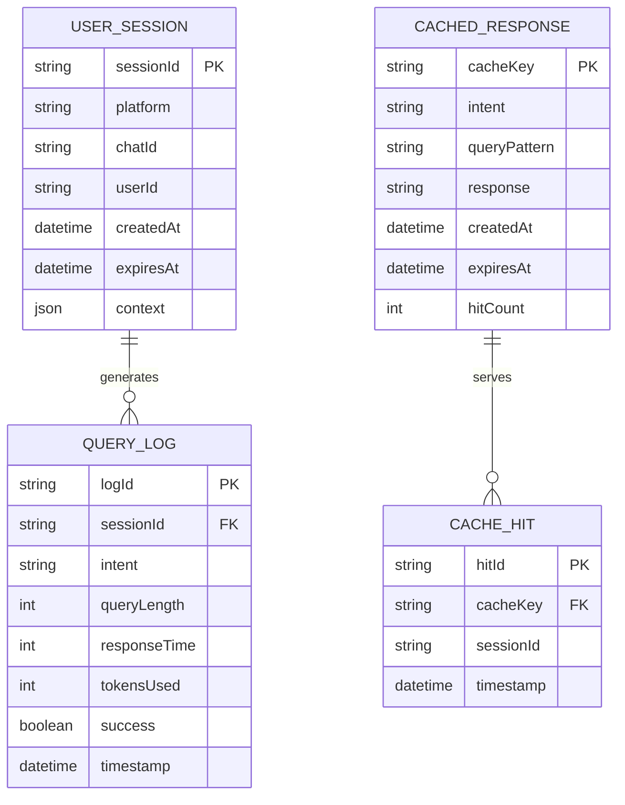
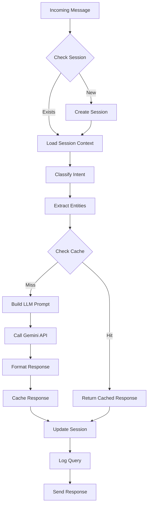
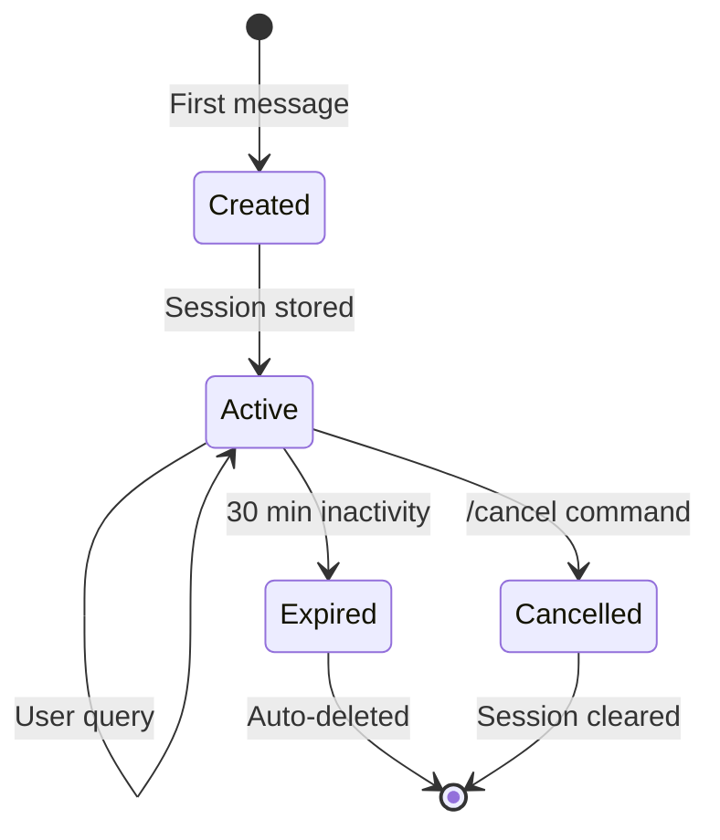

# Data Model & Schema Design
## Drug Info and Guideline Bot

**Version:** 1.0  
**Date:** January 18, 2026  

---

## 1. Data Architecture Overview



---

## 2. Firestore Collections Schema

### 2.1 `sessions` Collection
**Purpose:** Track active conversation sessions

```typescript
interface Session {
  // Document ID: auto-generated or `{platform}_{chatId}`
  
  // Identity
  platform: 'telegram' | 'whatsapp';
  chatId: string;           // Platform chat ID
  userId: string;           // Platform user ID (hashed for privacy)
  
  // Session State
  state: 'active' | 'expired' | 'cancelled';
  currentIntent: Intent | null;
  
  // Context (for follow-up queries)
  context: {
    lastDrugMentioned?: string;
    lastConditionMentioned?: string;
    pendingClarification?: string;
    conversationHistory: ConversationTurn[];  // Last 5 turns
  };
  
  // Timestamps
  createdAt: Timestamp;
  updatedAt: Timestamp;
  expiresAt: Timestamp;     // 30 minutes from last activity
}

interface ConversationTurn {
  role: 'user' | 'assistant';
  content: string;
  timestamp: Timestamp;
}

type Intent = 
  | 'DRUG_INFO'
  | 'DRUG_INTERACTION'
  | 'DOSAGE_QUERY'
  | 'GUIDELINE_QUERY'
  | 'HELP'
  | 'UNKNOWN';
```

**Indexing:**
- Single-field: `expiresAt` (ascending) - for cleanup jobs
- Composite: `platform + chatId` - for session lookup

**TTL Policy:**
- Documents auto-delete when `expiresAt` is reached

---

### 2.2 `queryLogs` Collection  
**Purpose:** Anonymized analytics and usage tracking

```typescript
interface QueryLog {
  // Document ID: auto-generated
  
  // Session Reference (not a real FK, for analytics grouping)
  sessionId: string;
  platform: 'telegram' | 'whatsapp';
  
  // Query Details
  intent: Intent;
  queryCategory: string;      // e.g., "antibiotic", "cardiovascular"
  queryLength: number;        // Character count
  
  // Response Metrics
  responseTimeMs: number;
  tokensUsed: number;
  modelUsed: string;          // e.g., "gemini-2.0-flash"
  
  // Outcome
  success: boolean;
  errorType?: string;         // e.g., "LLM_TIMEOUT", "RATE_LIMITED"
  fromCache: boolean;
  
  // Metadata
  timestamp: Timestamp;
  date: string;               // "2026-01-18" for daily aggregation
}
```

> [!CAUTION]
> **Never log actual query text or response content** - only metadata for analytics

**Indexing:**
- Single-field: `timestamp` (descending) - for recent logs
- Single-field: `date` - for daily reporting
- Composite: `platform + intent + date` - for analytics queries

---

### 2.3 `responseCache` Collection
**Purpose:** Cache frequent queries to reduce LLM costs

```typescript
interface CachedResponse {
  // Document ID: hash of normalized query
  
  // Cache Key Components
  intent: Intent;
  normalizedQuery: string;    // Lowercase, trimmed, standardized
  queryHash: string;          // MD5 or SHA256 of normalized query
  
  // Cached Data
  response: string;           // Formatted response text
  responseMetadata: {
    sources: string[];        // Citations
    drugsMentioned: string[];
    generatedAt: Timestamp;
    modelVersion: string;
  };
  
  // Cache Management
  hitCount: number;
  lastHitAt: Timestamp;
  createdAt: Timestamp;
  expiresAt: Timestamp;       // 24 hours default, 7 days for guidelines
}
```

**Cache Key Strategy:**
```
cacheKey = hash(intent + normalizedQuery)

Example:
intent: "DRUG_INFO"
query: "Tell me about Metformin"
normalizedQuery: "drug_info:metformin"
cacheKey: "di_a3f2b1c9..."
```

**Indexing:**
- Single-field: `expiresAt` (ascending) - for cleanup
- Single-field: `hitCount` (descending) - for analytics

---

### 2.4 `analytics` Collection (Aggregated)
**Purpose:** Pre-computed daily/weekly analytics

```typescript
interface DailyAnalytics {
  // Document ID: "daily_{date}" e.g., "daily_2026-01-18"
  
  date: string;
  
  // Volume Metrics
  totalQueries: number;
  uniqueUsers: number;
  queriesByPlatform: {
    telegram: number;
    whatsapp: number;
  };
  queriesByIntent: {
    DRUG_INFO: number;
    DRUG_INTERACTION: number;
    DOSAGE_QUERY: number;
    GUIDELINE_QUERY: number;
    HELP: number;
    UNKNOWN: number;
  };
  
  // Performance Metrics
  avgResponseTimeMs: number;
  p95ResponseTimeMs: number;
  totalTokensUsed: number;
  cacheHitRate: number;       // Percentage
  
  // Reliability Metrics
  successRate: number;        // Percentage
  errorsByType: Record<string, number>;
  
  // Timestamps
  computedAt: Timestamp;
}
```

---

## 3. In-Memory Data Structures

### 3.1 Normalized Message Object
```typescript
interface NormalizedMessage {
  // Identity
  messageId: string;
  platform: 'telegram' | 'whatsapp';
  
  // Sender Info
  chatId: string;
  userId: string;
  
  // Content
  text: string;
  command?: string;           // e.g., "/drug" if command message
  commandArgs?: string[];     // Arguments after command
  
  // Metadata
  timestamp: Date;
  replyToMessageId?: string;  // If this is a reply
  
  // Platform-specific (for response routing)
  rawPayload: any;            // Original webhook payload
}
```

### 3.2 LLM Request Context
```typescript
interface LLMContext {
  // Session State
  sessionId: string;
  conversationHistory: ConversationTurn[];
  
  // Current Query
  intent: Intent;
  userMessage: string;
  extractedEntities: {
    drugs?: string[];
    conditions?: string[];
    patientAge?: number;
    patientWeight?: number;
    renalFunction?: number;   // CrCl or eGFR
  };
  
  // Prompt Configuration
  systemPrompt: string;
  temperature: number;
  maxTokens: number;
}
```

### 3.3 Bot Response Object
```typescript
interface BotResponse {
  // Content
  text: string;
  formattedText: {
    telegram: string;         // Telegram MarkdownV2
    whatsapp: string;         // WhatsApp formatting
  };
  
  // Interactive Elements
  inlineButtons?: InlineButton[][];  // Telegram inline keyboard
  quickReplies?: string[];           // WhatsApp quick replies
  
  // Metadata
  sources: string[];
  disclaimer: string;
  fromCache: boolean;
  
  // Metrics
  processingTimeMs: number;
  tokensUsed: number;
}

interface InlineButton {
  text: string;
  callbackData: string;       // e.g., "more_info:metformin"
}
```

---

## 4. Data Flow Diagrams

### 4.1 Query Processing Flow



### 4.2 Session Lifecycle



---

## 5. Data Retention Policy

| Data Type | Retention Period | Reason |
|-----------|------------------|--------|
| Sessions | 30 minutes (TTL) | Memory efficiency |
| Query Logs | 90 days | Analytics & debugging |
| Response Cache | 24 hours (drugs) / 7 days (guidelines) | Cost optimization |
| Daily Analytics | 1 year | Trend analysis |

---

## 6. Privacy Considerations

### 6.1 Data Minimization
| Data | Stored | Notes |
|------|--------|-------|
| User phone/ID | Hashed only | Never plain text |
| Query text | **No** | Only metadata logged |
| Response text | Cached only | No user association |
| IP address | **No** | Not collected |

### 6.2 Anonymization Strategy
```typescript
function anonymizeUserId(platform: string, rawId: string): string {
  const salt = process.env.ANONYMIZATION_SALT;
  return crypto
    .createHash('sha256')
    .update(`${platform}:${rawId}:${salt}`)
    .digest('hex')
    .substring(0, 16);
}
```

---

## 7. Firestore Security Rules

```javascript
rules_version = '2';
service cloud.firestore {
  match /databases/{database}/documents {
    // Backend-only access (service account)
    // No client-side access needed
    
    match /sessions/{sessionId} {
      allow read, write: if false;  // Backend only via Admin SDK
    }
    
    match /queryLogs/{logId} {
      allow read, write: if false;  // Backend only
    }
    
    match /responseCache/{cacheId} {
      allow read, write: if false;  // Backend only
    }
    
    match /analytics/{docId} {
      allow read, write: if false;  // Backend only
    }
  }
}
```

> [!NOTE]
> All Firestore access is via Admin SDK from Cloud Functions. No client-side access rules needed.

---

## 8. Migration & Versioning

### 8.1 Schema Versioning
```typescript
interface SchemaVersion {
  collection: string;
  version: number;
  migratedAt: Timestamp;
}

// Document: schemaVersions/sessions
// { collection: "sessions", version: 1, migratedAt: ... }
```

### 8.2 Backward Compatibility
- Add new fields with defaults
- Never remove fields in production
- Use feature flags for schema changes
